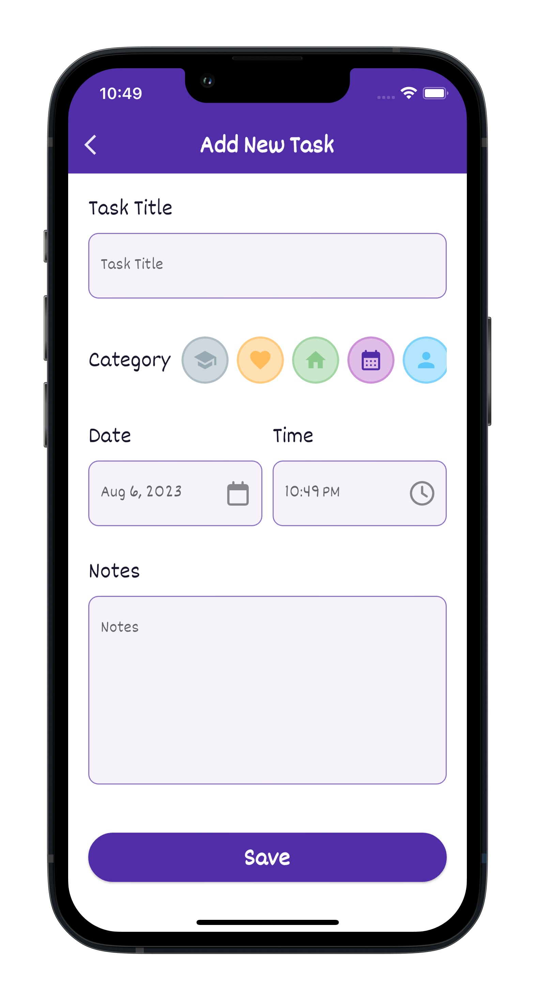

# flutter_todo_app

仿 [github](https://github.com/IsaiasCuvula/flutter_riverpod_todo_app)，主要的庫為 `riverpod` `sqlite` `go_router`

> 項目示意圖

<table>
  <thead>
    <tr>
      <th>首頁</th>
      <th>新增事項頁</th>
      <th>詳情彈窗</th>
    </tr>
  </thead>
  <tbody>
    <tr>
      <td></td>
      <td></td>
      <td></td>
    </tr>
  </tbody>
</table>
